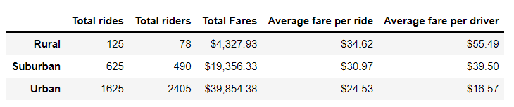
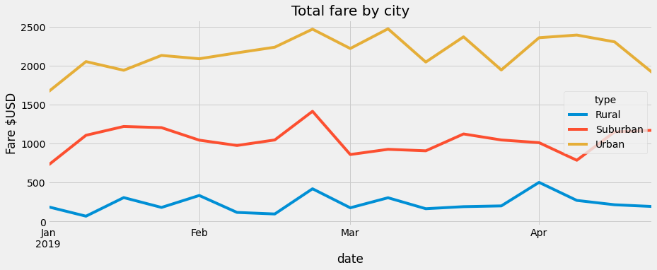

# PyBer Analysis
## Background
Pyber is a ride sharing app company valued at 2.3 billion. Large CSV files have been generated to store the riding data for different cities. The CEO of the company was a former programmer so have been particularly insistent that the analytical work be comprehensive and correct. 
The data generated has been divided into 3 City Types - ***Urban, Suburban and  Rural.*** 

## Purpose 
This project is about creating visualizations of rideshare data for PyBer to help improve access to ride-sharing services and determine affordability for underserved neighborhoods.CEO is expert in data Visualization so getting the right charts is very important. The application was created in Python and now to generate the charts we are going to use Pandas and Matplotlib Library

The analysis of this project will generate a summarized chart for CEO to help and determine affordibility and improve the services to server the neighborhoods better.
* [Pyber Summary of the data for each City Type](#Pyber-Summary)
  This chart will give the following information
	- The total number of rides for each city type
	- The total number of drivers for each city type
	- The sum of the fares for each city type
	- The average fare per ride for each city type
 	- The average fare per driver for each city type
 	
* [Line Chart that shows the total weekly of the fares for each type of city](#Line-Chart-Weekly-Data-Summary)

## Results

The two files used for anlayzing the data are:
 - [City Data](#https://github.com/DeepaGheewala/PyBer_Analysis/blob/09fef76dc97c26e4ac5b90ea6409d7350cbf1088/Resources/city_data.csv) - having the data of driver count for each city and city type
 - [Ride Data](#https://github.com/DeepaGheewala/PyBer_Analysis/blob/09fef76dc97c26e4ac5b90ea6409d7350cbf1088/Resources/rider_data.csv) - having the data of ride counts for each city and city type

### Pyber Summary

  This gives an overall summary for the entire dataset of Pyber riding services for each city type
  

 The above data clearly shows that Pyber has been extremely popular and widely used service in Urban areas.
 - **The total number of rides for each city type** 
	- the usage of Pyber in Rural areas is *13 times* less than in Urban areas, where as its *2.6 times* less in Subarban areas. 
 - **The total number of drivers for each city type** 
	- the drives signed up in Urban is exponentially high compared to Rural and Subarban
	- Rides to Driver ratio 
		* Urban - 0.6
 		* Subarban = 1.27
 		* Rural = 1.6
	- This clearly shows that more drivers needed for Subarban and Rural areas to serve better
 - **The sum of the fares for each city type**
	- From the above data we can notice Urban fare total is highest and Rural the lowest.
 - **The average fare per ride for each city type**
	- Due to less avaibility of drivers compared to rides the fare is higher in Rural compared to Urban.
 - **The average fare per driver for each city type**
	- Due to less avaibility of drivers compared to rides the fare is higher in Rural compared to Urban.

### Line Chart Weekly Data Summary
	The Below line chart depicts the weekly data summary for each city type
	- Overall fare of Rural Area doesn't exceed $500
	- Fare Range for Subarban Area is between $600-$1500
	- Fare Range for Urban Area is between $1500-$2500
	- Around Feb last week there is a spike in Pyber rides in all the three areas. 
	
  
  
## Summary 

 By Analyzing the pyber data and charts here are some suggestions  
	
1) *Increase the Drives in Rural and Subarban Areas* - Seeing the data of ratio of Drivers in each city type it clearly shows that *more drivers need to sign up* with Pyber for *Subarban* and *Rural* areas to serve better  
2) *Reducing the Fare price* - Data shows that avergare rate per ride is 6$ - $10 more in Subarban and Rural areas, which can be reduced and increase the use of Pyber ride service.  
3) *Plan and prep for special occasions/events* - During the Feb last week there is spike in Pyber rides in all the 3 areas which shows occurance of some event or special day when more rides would be required.  
4) *Better Marketing Strategy*  
	- More marketing in the cities where drivers are less 
	- Showing benefits of using Pyber rides as rider and as driver
		
